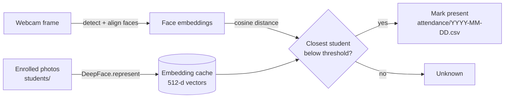

# Smart Attendance 📸

Face-recognition attendance from a webcam. Enroll students once, open the camera, and everyone who walks into frame is recognised and marked present, with a live roster and a daily CSV record.

Built with **DeepFace** (Facenet512 embeddings) and **OpenCV**.

## Features

- **Live attendance**: continuous recognition from the webcam, multiple faces per frame, each student marked once per day
- **Smooth UI**: recognition runs on a background thread, so the video never freezes while the model works
- **Live roster sidebar**: present / total count, progress bar, check-in times, and who's still missing
- **Webcam enrollment**: `enroll "Name"` captures photos only when exactly one face is in frame
- **Photo mode**: take attendance from a class photo and save an annotated copy
- **Daily reports**: present and absent lists for any date
- **Embedding cache**: enrolled photos are embedded once; only new or edited photos are re-processed on startup
- **Configurable**: swap recognition model, face detector, match threshold, or camera from the command line
- **Private by default**: face photos and attendance records are git-ignored

## How it works



1. **Enrollment.** Every photo in `students/` is turned into a 512-number embedding with Facenet512. Embeddings are cached, keyed by file path, size and modification time.
2. **Detection.** Each scan, the frame is downscaled to 640 px wide for speed. Faces are detected and aligned, then embedded.
3. **Matching.** Each face is compared to every enrolled embedding using cosine distance. The closest student wins if the distance is under the model's threshold (0.30 for Facenet512); otherwise the face is labelled *Unknown*. Several photos per student make this much more robust.
4. **Logging.** A recognised student is appended to today's CSV once. Restarting the app reloads the day's file, so nobody gets marked twice.

Scans run on a worker thread that always processes the latest frame. In testing, a scan took about 0.3 s on CPU, with no GPU needed.

## Quick start

Requires **Python 3.10–3.12** and a webcam.

### Windows: one click

Double-click **`run.bat`**. On first run it creates a virtual environment and installs everything. After that, it opens a menu:

```
  1  Start live attendance
  2  Start in manual mode  (SPACE to scan)
  3  Enroll a student
  4  Today's report
  5  List students
  6  Quit
```

You can also pass commands straight through, e.g. `run.bat run --manual` or `run.bat report --date 2026-10-01`.

### Manual setup (any OS)

```bash
git clone https://github.com/SkipperAli/Smart-Attendance.git
cd Smart-Attendance

python -m venv .venv
# Windows
.venv\Scripts\activate
# macOS / Linux
source .venv/bin/activate

pip install -r requirements.txt
```

> **Windows PowerShell:** if activation is blocked, run `Set-ExecutionPolicy -Scope CurrentUser RemoteSigned` once.

Enroll yourself, then start:

```bash
python attendance.py enroll "Ali Abbas"
python attendance.py run
```

The first run downloads the Facenet512 weights (~95 MB) to `~/.deepface`.

## Usage

```bash
python attendance.py run                         # live attendance (auto mode)
python attendance.py run --manual                # only scan when you press SPACE

python attendance.py enroll "Sara Khan"          # capture 5 photos from the webcam
python attendance.py enroll "Sara Khan" --shots 8
python attendance.py enroll "Sara Khan" a.jpg b.jpg   # import existing photos instead

python attendance.py scan class.jpg --out scanned/    # attendance from a photo
python attendance.py scan class.jpg --no-mark         # just recognise, don't record

python attendance.py report                      # today's present / absent list
python attendance.py report --date 2026-10-01

python attendance.py students                    # list enrolled students
```

### Live controls

| Key | Action |
| --- | ------ |
| `SPACE` | Scan now |
| `A` | Toggle auto scanning |
| `Q` / `Esc` | Quit |

Box colours: **green** means just recognised, **teal** means already marked today, and **red** means unknown face.

### Options

Global options go *before* the command, e.g. `python attendance.py --camera 1 run`.

| Option | Default | Description |
| ------ | ------- | ----------- |
| `--model` | `Facenet512` | `Facenet512`, `ArcFace`, `Facenet`, `SFace`, `VGG-Face`, `GhostFaceNet` |
| `--detector` | `opencv` | Face detector: `opencv` is fastest; `retinaface` / `mtcnn` are more accurate but slower and need extra packages |
| `--threshold` | model default | Max cosine distance for a match. Lower is stricter |
| `--camera` | `0` | Webcam index |
| `--students` | `./students` | Folder of enrolled photos |
| `run --interval` | `0.8` | Seconds between auto scans |
| `run --rebuild` | off | Re-embed all enrolled photos (ignore the cache) |

## Project structure

```
Smart-Attendance/
├── attendance.py               # CLI: run / enroll / scan / report / students
├── run.bat                     # Windows launcher: setup + menu
├── smart_attendance/
│   ├── config.py               # settings and per-model thresholds
│   ├── embedder.py             # DeepFace wrapper: image -> face boxes + embeddings
│   ├── database.py             # enrollment discovery, embedding cache, matching
│   ├── recognition.py          # recognise() + background RecognitionWorker thread
│   ├── live.py                 # webcam loop
│   ├── enroll.py               # webcam capture / photo import
│   ├── attendance_log.py       # daily CSV, one mark per student per day
│   └── ui.py                   # OpenCV overlays and roster sidebar
├── students/                   # enrolled photos (git-ignored)
├── attendance/                 # daily CSV records (git-ignored)
├── tests/                      # unit tests (no TensorFlow needed)
└── requirements.txt
```

## Tests

```bash
pip install -r requirements-dev.txt
pytest
```

The unit tests cover matching, thresholding, cache invalidation and the attendance log. They use fake embeddings, so they run in under a second without loading TensorFlow.

## Getting good accuracy

- Enroll **3–5 photos per person** with slightly different angles and lighting.
- Keep the camera at face height with light in front of people, not behind them.
- If strangers get matched, lower the threshold (e.g. `--threshold 0.25`). If known people show as *Unknown*, add more enrollment photos before raising it.

## Limitations

- **No liveness detection.** Holding up a photo of someone can mark them present. Don't use this where attendance has real consequences without adding anti-spoofing.
- Accuracy drops with poor lighting, heavy occlusion (masks, sunglasses), or faces far from the camera.
- Built for classroom-sized groups. Matching is brute-force, which is fine for hundreds of students; thousands would want a vector index such as FAISS.

## Roadmap

- Anti-spoofing / liveness check
- Web dashboard for reports
- Export to Excel / Google Sheets
- Per-class rosters and time windows (late marking)
